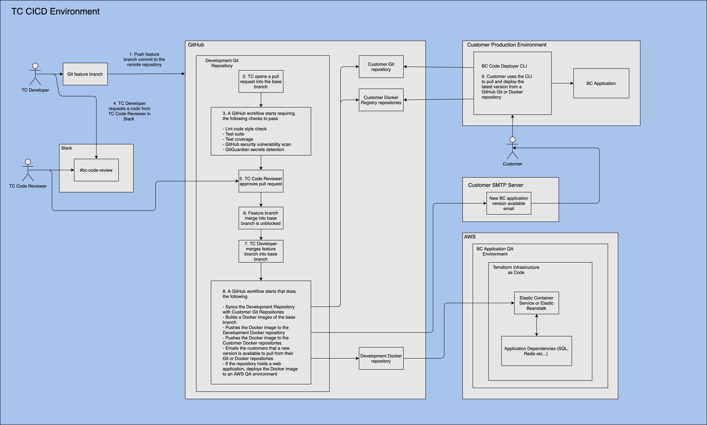

# TC CICD Template
This project contains DevOps dependencies for integrating an application into BC's CICD pipeline to automate testing
and deployment. The purpose of this project is to provide deployment layer support, while being agnostic to application 
layer code. Application layer code must exist in the `src` folder. More coming... 
## CICD Pipeline
  
## [Box Folder with additional CICD resources](https://cloud.box.com/s/8j8hck9nz3rnvjzk5f9yw091n1woepks) 
diff 1
